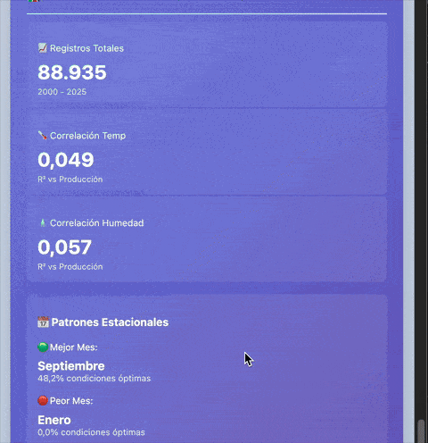

# Chocolate Factory - Energy Optimization System

Containerized system for energy monitoring and production optimization with machine learning and automated CI/CD.

[](https://docker.com)
[](https://python.org)
[](https://fastapi.tiangolo.com)
[](https://influxdata.com)
[](https://tailscale.com)
[](https://forgejo.org)
[](https://github.com)

---

## Overview

Energy optimization system combining machine learning price forecasting, automated data ingestion, and self-hosted CI/CD infrastructure.

**Key Metrics**:
- 131,513 historical records (REE electricity prices + weather data, 2000-2025)
- Prophet ML: 168-hour price forecasting (MAE: 0.033 €/kWh)
- ROI: 1,661€/year energy savings (85.33% vs fixed schedule)
- Testing: 102 tests (100% passing, 19% coverage, 36 E2E tests)
- Clean Architecture: 41 modules (98% reduction from monolithic main.py)
- CI/CD: Automated testing + smoke tests + rollback on failure
- Observability: Tailscale health monitoring (uptime tracking, critical nodes alerts)

**Components**:
- FastAPI application with ML models (Prophet, sklearn RandomForest)
- InfluxDB time series database
- Forgejo self-hosted Git + CI/CD (Gitea Actions)
- Tailscale mesh network with automatic SSL
- Claude Haiku chatbot with RAG for conversational BI

### Dashboard Preview

<table>
  <tr>
    <td style="text-align:center; width:50%;">
      
      <p><em>Dashboard Principal - ML Predictions & Insights</em></p>
    </td>
    <td style="text-align:center; width:50%;">
      
      <p><em>Chatbot BI - Claude Haiku with RAG</em></p>
    </td>
  </tr>
</table>

---

## Architecture

### Infrastructure (3-Node Tailscale Network)

```
┌──────────────────────────────────────────────────────────────────┐
│  TAILSCALE NETWORK (Zero-Trust VPN)                             │
├──────────────────────────────────────────────────────────────────┤
│                                                                  │
│  ┌────────────────────────┐  ┌────────────────────────────┐    │
│  │  NODE 1: GIT/CI/CD     │  │  NODE 2: DEVELOPMENT       │    │
│  │  git.*.ts.net          │  │  *-dev.ts.net              │    │
│  │                        │  │                            │    │
│  │  - Forgejo 1.21        │  │  - FastAPI (dev)           │    │
│  │  - Runners (dev/prod)  │  │  - InfluxDB shared (read)  │    │
│  │  - Docker Registry     │  │  - Hot reload enabled      │    │
│  │  - Nginx SSL           │  │  - Port 8001               │    │
│  └────────────────────────┘  └────────────────────────────┘    │
│                                                                  │
│  ┌────────────────────────────────────────────────────┐         │
│  │  NODE 3: PRODUCTION                                │         │
│  │  *.ts.net                                          │         │
│  │                                                    │         │
│  │  - FastAPI (prod)                                 │         │
│  │  - InfluxDB (data ingestion)                      │         │
│  │  - ML models (Prophet, sklearn)                   │         │
│  │  - APScheduler (11 jobs)                          │         │
│  │  - Port 8000                                      │         │
│  │  - Nginx SSL                                      │         │
│  └────────────────────────────────────────────────────┘         │
│                                                                  │
└──────────────────────────────────────────────────────────────────┘

Pipeline: develop → dev | main → prod
SSL: Tailscale ACME certificates
Secrets: SOPS encrypted + .env fallback
```

### Application (Clean Architecture - Oct 2025)

```
src/fastapi-app/
├── main.py (76 lines)           # Entry point
├── api/                         # HTTP Interface
│   ├── routers/                 # 10 routers (health, dashboard, ree, weather,
│   │                            #   optimization, analysis, insights, gaps,
│   │                            #   chatbot, analytics)
│   └── schemas/                 # Pydantic models
├── domain/                      # Business Logic
│   ├── energy/forecaster.py    # Price forecasting
│   └── ml/model_trainer.py     # ML validation
├── services/                    # Orchestration
│   ├── ree_service.py          # REE + InfluxDB
│   ├── weather_aggregation.py  # Multi-source weather
│   ├── dashboard.py            # Data consolidation
│   ├── predictive_insights.py  # ML insights
│   ├── chatbot_service.py      # Claude Haiku API
│   ├── backfill_service.py     # Gap recovery
│   └── tailscale_analytics_service.py  # Tailscale observability (HTTP)
├── infrastructure/              # External Systems
│   ├── influxdb/               # DB client + queries
│   └── external_apis/          # REE, AEMET, OpenWeatherMap
├── core/                        # Utilities
│   ├── config.py               # Settings
│   ├── logging_config.py       # Structured logging
│   └── exceptions.py           # Error handling
└── tasks/                       # Background Jobs
    ├── ree_jobs.py             # REE ingestion
    ├── weather_jobs.py         # Weather ingestion
    └── scheduler_config.py     # APScheduler

Refactoring: 3,838 → 76 lines main.py (98% reduction)
Modules: 41 Python files organized by layer
```

### Security

**Network**:
- Isolated Docker network (MTU 1280)
- No direct internet port exposure
- Tailscale sidecar as single external gateway

**Reverse Proxy (Nginx)**:
- Whitelist approach: `/dashboard` and static resources only
- Administrative endpoints blocked (`/docs`, `/predict`, `/models`)
- HTTP 403 for data modification endpoints

**Tailscale**:
- WireGuard-based encrypted tunnels
- Identity-based access
- Automatic SSL/TLS certificates

**Secrets Management**:
- SOPS + age encryption for commitable secrets
- Fallback to `.env` for local development
- 14 credentials managed (InfluxDB, API keys, Tailscale)

### Technology Stack

| Component | Technology | Purpose |
|-----------|-----------|---------|
| **Backend** | FastAPI (Python 3.11+) | REST API + Dashboard |
| **Database** | InfluxDB 2.7 | Time series storage |
| **ML Framework** | scikit-learn, Prophet | Price forecasting + optimization |
| **Chatbot** | Claude Haiku 3.5 | Conversational BI (RAG) |
| **CI/CD** | Forgejo + Gitea Actions | Self-hosted automation |
| **Registry** | Docker Registry 2.8 | Private image storage |
| **Scheduling** | APScheduler | 11 automated jobs |
| **Containerization** | Docker Compose | Orchestration |
| **Reverse Proxy** | Nginx (Alpine) | SSL + endpoint filtering |
| **VPN** | Tailscale (WireGuard) | Zero-trust mesh network |
| **Secrets** | SOPS + age | Encrypted secrets management |

---

## Data Sources

### Real-time Integration

1. **REE (Red Eléctrica de España)**
   - Spanish electricity market prices (PVPC)
   - Hourly updates via API
   - 42,578 historical records (2022-2025)

2. **AEMET (Spanish State Meteorological Agency)**
   - Official weather observations (Station 5279X - Linares)
   - Active hours: 00:00-07:00 UTC
   - Temperature, humidity, pressure

3. **OpenWeatherMap**
   - Complementary weather data (08:00-23:00 UTC)
   - 24/7 coverage when combined with AEMET

### Historical Data

**SIAR (Agricultural Climate Information System)**:
- 88,935 weather records (2000-2025)
- 25 years historical coverage
- 10 meteorological variables
- 2 stations: J09 (2000-2017) + J17 (2018-2025)

---

## Implementation Status

### Completed Sprints

| Sprint | Date | Description | Key Metrics |
|--------|------|-------------|-------------|
| 06 | Oct 2025 | Prophet Price Forecasting | MAE: 0.033 €/kWh, R²: 0.49 |
| 07 | Oct 2025 | SIAR Historical Analysis | 88,935 records, 25 years |
| 08 | Oct 2025 | Hourly Production Optimization | 85.33% savings vs baseline |
| 09 | Oct 2025 | Unified Predictive Dashboard | 7-day forecast integration |
| 10 | Oct 2025 | ML Documentation & Validation | Feature engineering validated |
| 11 | Oct 2025 | Chatbot BI (Claude Haiku) | RAG + keyword matching |
| 12 | Oct 2025 | Forgejo CI/CD + Testing Suite | 102 tests, 19% coverage, automated rollback |
| 13 | Oct 2025 | Health Monitoring (Pivoted) | 5 endpoints, uptime tracking, critical nodes alerts |

### ML Models

- **Price Forecasting**: Prophet 168h ahead
- **Energy Optimization**: RandomForest regressor (R²: 0.89)
- **Production Recommendation**: RandomForest classifier (90% accuracy)
- **Historical Analysis**: SIAR correlations (R²=0.049 temp, R²=0.057 humidity)
- **ROI Tracking**: 1,661€/year savings (4.55€/day vs baseline)

Full documentation: [`docs/ML_ARCHITECTURE.md`](docs/ML_ARCHITECTURE.md)

---

## Quick Start

### Prerequisites

- Docker 20.10+ and Docker Compose 2.0+
- API keys:
  - AEMET: https://opendata.aemet.es/centrodedescargas/obtencionAPIKey
  - OpenWeatherMap: https://openweathermap.org/api
  - Anthropic (optional): https://console.anthropic.com/

### Local Development

```bash
# 1. Configure environment
cp .env.example .env
# Edit .env with your API keys

# 2. Start services
docker compose up -d

# 3. Access
http://localhost:8000/docs               # Full API
http://localhost:8000/dashboard          # Dashboard
http://localhost:8086                    # InfluxDB UI
```

### Production Deployment (3-Node Setup)

```bash
# Node 1: Git/CI/CD
docker compose -f docker/forgejo-compose.yml up -d
docker compose -f docker/gitea-runners-compose.yml up -d
docker compose -f docker/registry-compose.yml up -d

# Node 2: Development
docker compose -f docker-compose.dev.yml up -d

# Node 3: Production
docker compose -f docker-compose.prod.yml up -d

# Tailscale sidecars (each node)
docker compose -f docker-compose.override.yml up -d
```

**Access**:
- Git: `https://git.your-tailnet.ts.net`
- Dev: `https://dev.your-tailnet.ts.net` (port 8001)
- Prod: `https://your-tailnet.ts.net` (port 8000)

### Running Tests

```bash
# All tests (66 tests)
pytest src/fastapi-app/tests/ -v

# By category
pytest src/fastapi-app/tests/ml/ -v           # ML tests (12 tests)
pytest src/fastapi-app/tests/unit/ -v         # Unit tests (33 tests)
pytest src/fastapi-app/tests/integration/ -v  # Integration tests (21 tests)

# With coverage
pytest src/fastapi-app/tests/ -v --cov --cov-report=term-missing
```

### Development Workflow (Git Flow + CI/CD)

```bash
# 1. Feature development
git checkout develop
git flow feature start my-feature
# ... make changes ...
git flow feature finish my-feature
git push origin develop  # → Triggers CI/CD → Deploys to dev

# 2. Release to production
git flow release start 0.70.0
# ... version bump, CHANGELOG update ...
git flow release finish 0.70.0
git checkout main
git push origin main --follow-tags  # → Triggers CI/CD → Deploys to prod
git checkout develop
git push origin develop
```

See: [`docs/GITFLOW_CICD_WORKFLOW.md`](docs/GITFLOW_CICD_WORKFLOW.md)

---

## Project Structure

```
chocolate-factory/
├── src/fastapi-app/           # Clean Architecture (Oct 2025)
│   ├── main.py                # Entry point (76 lines)
│   ├── api/                   # HTTP Interface Layer
│   │   ├── routers/           # 9 routers
│   │   └── schemas/           # Pydantic models
│   ├── domain/                # Business Logic Layer
│   ├── services/              # Application Layer
│   ├── infrastructure/        # External Systems Layer
│   ├── core/                  # Utilities
│   └── tasks/                 # APScheduler jobs
├── docker/                    # Infrastructure
│   ├── docker-compose.yml     # Production (2 containers)
│   ├── docker-compose.dev.yml # Development environment
│   ├── docker-compose.prod.yml # Production environment
│   ├── forgejo-compose.yml    # Git/CI/CD node
│   ├── gitea-runners-compose.yml # CI/CD runners
│   ├── registry-compose.yml   # Docker registry
│   └── services/              # Persistent data
├── .gitea/workflows/          # CI/CD Pipelines
│   ├── ci-cd-dual.yml         # Main pipeline (dual env)
│   └── quick-test.yml         # Fast PR validation
├── .claude/                   # Documentation
│   ├── sprints/
│   │   ├── ml-evolution/      # Sprints 06-10
│   │   └── infrastructure/    # Sprints 11-13
│   ├── architecture.md        # System design
│   └── rules/                 # Business logic
├── docs/                      # Technical documentation
│   ├── ML_ARCHITECTURE.md     # ML system documentation
│   ├── CI_CD_PIPELINE.md      # Pipeline documentation
│   ├── GITFLOW_CICD_WORKFLOW.md # Git workflow
│   └── DUAL_ENVIRONMENT_SETUP.md # Environment setup
└── CLAUDE.md                  # Development guide
```

---

## Documentation

### Development References

- [`CLAUDE.md`](CLAUDE.md): Complete project reference
- [`.claude/architecture.md`](.claude/architecture.md): System design
- [`docs/ML_ARCHITECTURE.md`](docs/ML_ARCHITECTURE.md): ML system documentation

### Sprint Documentation

- [`ml-evolution/README.md`](.claude/sprints/ml-evolution/README.md): Sprints 06-10
- [`infrastructure/SPRINT_12_FORGEJO_CICD.md`](.claude/sprints/infrastructure/SPRINT_12_FORGEJO_CICD.md): CI/CD implementation
- [`infrastructure/README.md`](.claude/sprints/infrastructure/README.md): Infrastructure roadmap

### Technical Guides

- [`CI_CD_PIPELINE.md`](docs/CI_CD_PIPELINE.md): Pipeline architecture and troubleshooting
- [`GITFLOW_CICD_WORKFLOW.md`](docs/GITFLOW_CICD_WORKFLOW.md): Git workflow with CI/CD
- [`DUAL_ENVIRONMENT_SETUP.md`](docs/DUAL_ENVIRONMENT_SETUP.md): Dev/prod environment configuration
- [`CLEAN_ARCHITECTURE_REFACTORING.md`](docs/CLEAN_ARCHITECTURE_REFACTORING.md): Architecture migration guide
- [`API_REFERENCE.md`](docs/API_REFERENCE.md): Complete API documentation
- [`AUTOMATIC_BACKFILL_SYSTEM.md`](docs/AUTOMATIC_BACKFILL_SYSTEM.md): Gap detection and recovery
- [`SOPS_SECRETS_MANAGEMENT.md`](docs/SOPS_SECRETS_MANAGEMENT.md): Secrets encryption

### Business Rules

- [`production_rules.md`](.claude/rules/production_rules.md): Production optimization logic
- [`business-logic-suggestions.md`](.claude/rules/business-logic-suggestions.md): ML recommendations
- [`security-sensitive-data.md`](.claude/rules/security-sensitive-data.md): Data protection guidelines

---

## Data Persistence

Docker bind mounts ensure data survives container restarts:

- **InfluxDB**: `./docker/services/influxdb/{dev,prod}-data/`
- **ML Models**: `./models/`
- **Logs**: `./docker/services/fastapi/logs/`
- **Forgejo**: `./docker/services/forgejo/data/`
- **Registry**: `./docker/services/registry/data/`

---

## License

Provided as-is for educational and research purposes.

---

## Quick Links

| Resource | Description |
|----------|-------------|
| [Development Guide](CLAUDE.md) | Complete project reference |
| [Architecture](.claude/architecture.md) | System design |
| [ML Documentation](docs/ML_ARCHITECTURE.md) | ML system architecture |
| [ML Sprints](.claude/sprints/ml-evolution/README.md) | Sprints 06-10 roadmap |
| [CI/CD Sprint](.claude/sprints/infrastructure/SPRINT_12_FORGEJO_CICD.md) | Sprint 12 implementation |
| [API Docs](docs/API_REFERENCE.md) | Complete API reference |
| [Git Workflow](docs/GITFLOW_CICD_WORKFLOW.md) | Git Flow + CI/CD guide |

---

<div align="center">

Built with FastAPI, InfluxDB, Prophet ML, Forgejo CI/CD, and Tailscale

**Current Status**: Sprint 13 completed (Health Monitoring - Pivoted, Oct 21 2025)

</div>
