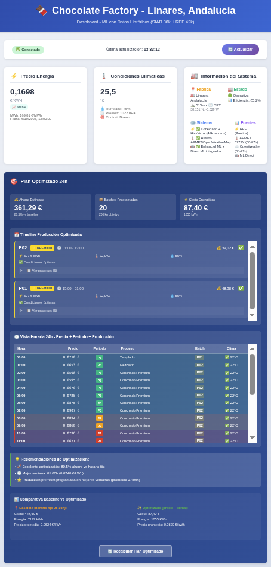
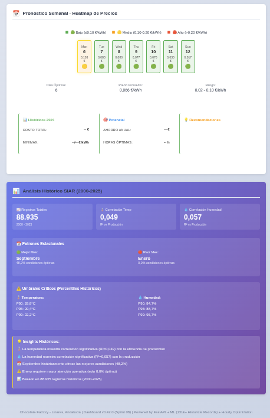

# 🍫 Chocolate Factory - Sistema de Monitoreo Personal

**Sistema autónomo de monitoreo energético y optimización de producción para uso personal**

[](https://docker.com)
[](https://python.org)
[](https://fastapi.tiangolo.com)
[](https://tailscale.com)

## 🎯 **Concepto del Proyecto**

Chocolate Factory es un **sistema personal de monitoreo y optimización** diseñado para funcionar completamente **on-premise** en tu infraestructura local, con acceso remoto seguro a través de **Tailscale**. No es una aplicación comercial - es una herramienta personal para experimentar con datos reales de energía española y aplicar machine learning de forma privada y controlada.

### 🏠 **Filosofía On-Premise + Personal**
- **Tus datos, tu control**: Todo funciona en tu hardware local
- **Sin dependencias cloud**: Infraestructura completamente autónoma 
- **Acceso privado**: Dashboard accesible solo desde tu Tailnet personal
- **Aprendizaje experimental**: Perfecto para proyectos académicos y desarrollo personal

## ✨ **Características Principales**

### 🌐 **Acceso Seguro Personal**
- **Tailscale Integration**: Acceso remoto cifrado desde cualquier dispositivo en tu tailnet
- **SSL Automático**: Certificados gestionados automáticamente por Tailscale
- **Dashboard Personal**: `https://chocolate-factory.tu-tailnet.ts.net/dashboard`
- **Zero-Config Security**: Sin configuración manual de firewalls o puertos

### ⚡ **Datos Reales de España**
- **REE (Red Eléctrica)**: Precios reales de electricidad española PVPC
- **AEMET**: Datos meteorológicos oficiales (Linares, Andalucía)
- **OpenWeatherMap**: Datos complementarios en tiempo real
- **Histórico Completo**: ETL automático de datos históricos

### 🤖 **Machine Learning Personal**
- **Direct ML Training**: sklearn + pickle storage (sin dependencias MLflow)
- **2 Modelos Productivos**: Energy Optimization (R²=0.89) + Production Classifier (90% accuracy)
- **Feature Engineering**: 13 características derivadas de datos reales REE+Weather
- **Predicciones Automáticas**: Recomendaciones cada 30 minutos

### 🔄 **Operación Autónoma**
- **Sistema Self-Healing**: Recuperación automática de gaps de datos
- **Scheduler Inteligente**: 10+ jobs automatizados con APScheduler
- **Monitoreo Continuo**: Health checks y alertas automáticas
- **Backup de Datos**: Persistencia garantizada con Docker bind mounts

## 🏗️ **Arquitectura Técnica**

### Simplified 2-Container Personal Infrastructure ✅

```
🔐 Tailscale Sidecar (Alpine)         🧠 FastAPI Brain
├── Nginx + SSL automático           ├── Dashboard integrado
├── Solo /dashboard expuesto          ├── APIs REST completas  
└── 52MB ultra-ligero                 └── ML predictions + scheduling

💾 InfluxDB Storage                   
├── Time series database               
├── REE + Weather data                 
└── Historical data ETL
```

### 🛡️ **Seguridad Personal**
- **Tailscale Zero-Trust**: Solo accesible desde tu tailnet privada
- **Endpoint Isolation**: APIs administrativas bloqueadas externamente
- **SSL End-to-End**: Cifrado automático con certificados válidos
- **Local-First**: Datos nunca salen de tu infraestructura

## 🚀 **Quick Start Personal**

### Prerrequisitos
- Docker & Docker Compose instalados
- Cuenta de Tailscale activa
- Claves API (REE, AEMET, OpenWeatherMap) - **gratis para uso personal**

### 1. **Configuración Inicial**
```bash
# Clonar el repositorio personal
git clone https://github.com/tu-usuario/chocolate-factory.git
cd chocolate-factory

# Configurar variables de entorno personales
cp .env.example .env
cp .env.tailscale.example .env.tailscale

# Editar con tus claves personales
nano .env .env.tailscale
```

### 2. **Obtener APIs Gratuitas** (Uso Personal)
```bash
# REE (España) - Datos públicos
# ✅ Sin registro requerido
REE_API_TOKEN=<your_token_here>

# AEMET - Registro gratuito
# 🌐 https://opendata.aemet.es/centrodedescargas/obtencionAPIKey
AEMET_API_KEY=<your_jwt_token>

# OpenWeatherMap - Plan gratuito
# 🌐 https://openweathermap.org/api
OPENWEATHERMAP_API_KEY=<your_api_key>

# Tailscale Auth Key
# 🌐 https://login.tailscale.com/admin/settings/keys
TAILSCALE_AUTHKEY=tskey-auth-<your-key-example>
```

### 3. **Lanzar Tu Sistema Personal**
```bash
# Construir y lanzar infraestructura completa
docker compose up -d

# Verificar que todo está corriendo
docker compose ps

# Ver logs del sistema
docker compose logs -f
```

### 4. **Acceder a Tu Dashboard Personal**
```bash
# Local (desarrollo) - Dashboard visual con heatmap semanal
http://localhost:8000/dashboard

# Datos JSON para desarrollo
http://localhost:8000/dashboard/complete

# Remoto seguro (desde cualquier lugar)
https://chocolate-factory.tu-tailnet.ts.net/dashboard
```

## 📱 **Dashboard en Acción**

### 🎯 **Vista Principal - Dashboard Visual con Heatmap Semanal**

*Dashboard completo con datos reales de REE, AEMET y predicciones ML para Linares, Andalucía*

**Características destacadas:**
- **📅 Heatmap Semanal**: Calendario visual 7 días con zonas de precios color-coded
- **⚡ Precio Energía**: Tiempo real con tendencia y predicción
- **🌡️ Condiciones Climáticas**: AEMET + OpenWeatherMap (cobertura 24/7)
- **🏭 Estado Fábrica**: Operativo con métricas en tiempo real
- **🤖 ML Predictions**: Optimización energética y recomendaciones producción
- **🎯 Interactive Tooltips**: Hover sobre cada día para detalles completos

### 📍 **Información Detallada del Sistema**

*Localización específica, fuentes de datos y estado completo del sistema*

**Fuentes de datos integradas:**
- **⚡ REE**: Precios electricidad España (conectado)
- **🌡️ AEMET**: Estación 5279X Linares (00:00-07:00)
- **☁️ OpenWeatherMap**: Tiempo real (08:00-23:00)
- **🤖 ML Models**: Modelos de producción específicos cargados

## 📊 **Casos de Uso Personales**

### 🏭 **Monitoreo Industrial Personal**
- **Optimización Energética**: Predicciones ML basadas en precios reales REE
- **Análisis Climático**: Datos AEMET + OpenWeatherMap para Andalucía
- **Recomendaciones Inteligentes**: Sistema experto para producción
- **Dashboard Profesional**: Visualización completa en tiempo real

### 💡 **Desarrollo Personal**
- **Learning FastAPI**: Proyecto real para aprender desarrollo web
- **DevOps Practice**: Docker, ML, scheduling, monitoreo
- **Data Engineering**: ETL, time series, feature engineering
- **Security Learning**: Tailscale, SSL, container security

### 🏠 **Uso Doméstico**
- **Monitoreo Energético**: Precios eléctricos para optimización personal
- **Dashboard Personal**: Visualización datos España desde casa
- **Experimentos ML**: Entrenar modelos con datos reales
- **Self-Hosting**: Infraestructura personal completamente privada

## 🔧 **Personalización y Desarrollo**

### 🎨 **Customización Personal**
```python
# Cambiar localización weather
# src/fastapi-app/services/aemet_client.py
AEMET_STATION_ID = "tu_estacion_local"
COORDINATES = (tu_lat, tu_lon)

# Personalizar intervalos
# Scheduler jobs en main.py
@scheduler.scheduled_job('cron', minute='*/15')  # Cada 15 min
```

### 📈 **Expandir Funcionalidades**
- **Nuevas APIs**: Integrar fuentes de datos adicionales
- **Modelos Custom**: Entrenar modelos específicos para tus necesidades
- **Alertas Personal**: Notificaciones Telegram/email personalizadas
- **Dashboard Custom**: Modificar visualizaciones según preferencias

## 🛠️ **Comandos Útiles de Desarrollo**

```bash
# Gestión de datos personales
curl http://localhost:8000/gaps/summary          # Estado datos
curl -X POST http://localhost:8000/gaps/backfill # Recuperar gaps

# Monitoreo sistema personal
curl http://localhost:8000/scheduler/status      # Estado jobs
curl http://localhost:8000/influxdb/verify      # Verificar DB

# ML personal
curl http://localhost:8000/models/status        # Estado modelos
curl http://localhost:8000/predict/energy-optimization # Predicciones energía
```

## 📖 **Documentación Técnica**

El proyecto incluye **25+ documentos técnicos** en `/docs/` cubriendo:

- **`SYSTEM_ARCHITECTURE.md`** - Arquitectura completa del sistema
- **`DIRECT_ML_IMPLEMENTATION.md`** - Pipeline ML simplificado
- **`TAILSCALE_INTEGRATION.md`** - Setup acceso remoto seguro
- **`AUTOMATIC_BACKFILL_SYSTEM.md`** - Sistema auto-recuperación
- **`QUICK_START_GUIDE.md`** - Guía rápida personalizada

## ⚡ **Rendimiento Personal**

### 📊 **Métricas del Sistema**
- **Modelos ML**: Energy R² = 0.89, Production accuracy = 90%
- **Cobertura Datos**: 24/7 con self-healing automático
- **Dashboard**: Heatmap interactivo con datos en tiempo real
- **Latencia**: <100ms respuesta API local
- **Recursos**: 4GB RAM, 2 CPU cores recomendados

### 🏃 **Optimizado para Personal**
- **Startup rápido**: <30 segundos sistema completo
- **Bajo consumo**: Ideal para Raspberry Pi 4, NUC, mini-PC
- **Auto-mantenimiento**: Funciona semanas sin intervención
- **Backup automático**: Estado persistente garantizado

## 🤝 **Contribuciones y Uso**

### 📜 **Licencia Uso Personal**
Este proyecto está diseñado para **uso personal y educativo**:
- ✅ Uso personal ilimitado
- ✅ Modificación y personalización
- ✅ Proyectos de desarrollo personal
- ✅ Aprendizaje y desarrollo personal

### 🌟 **Sharing & Community**
- **Fork personal**: Crea tu versión personalizada
- **Documentación**: Comparte mejoras y customizaciones
- **Issues**: Reporta bugs o solicita features personales
- **Discussions**: Ideas para expansión personal del sistema

## 🔮 **Roadmap Personal**

### 🎯 **Próximas Features**

#### 🔮 **Planificación de Producción Avanzada** (IMPLEMENTADO ✅)
- [x] **Dashboard Heatmap Semanal**: Calendario visual 7 días con precios REE + weather
- [x] **Integración Híbrida Weather**: AEMET + OpenWeatherMap para cobertura 24/7
- [x] **Interactive Tooltips**: Detalles completos hover por día (precio, clima, recomendación)
- [x] **Color-coded Price Zones**: Sistema visual de zonas de precio optimizado
- [ ] **Export Planning**: Calendarios producción exportables (PDF, CSV, iCal)
- [ ] **Extended Forecasts**: Ampliar a 14 días con precios futuros REE

**Implementación técnica**:
```python
# Endpoints actuales (✅ implementados)
GET /dashboard                              # Dashboard visual con heatmap semanal
GET /dashboard/complete                     # JSON completo datos dashboard
GET /weather/hybrid                         # Weather híbrido AEMET+OpenWeatherMap
GET /predict/energy-optimization            # Predicciones optimización energética
GET /predict/production-recommendation      # Recomendaciones producción inteligente

# Endpoints futuros
GET /predict/production-planning?days=14    # Planning extendido 2 semanas  
POST /planning/export?format=pdf           # Export calendarios producción
```

#### 📱 **Mejoras Inmediatas**
- [ ] **Mobile Dashboard**: App personal iOS/Android
- [ ] **Telegram Alerts**: Notificaciones personalizadas
- [ ] **Energy Automation**: Control dispositivos domóticos
- [ ] **Multi-Location**: Soporte múltiples ubicaciones
- [ ] **Advanced ML**: Deep learning models personales

### 🧪 **Experimental Features**
- [ ] **IoT Integration**: Sensores personales ESP32/Arduino
- [ ] **Home Assistant**: Integración domótica personal
- [ ] **Solar Optimization**: Cálculos energía solar personal
- [ ] **Cost Tracking**: Análisis facturas eléctricas reales

---

## 🏠 **¿Por qué Personal + On-Premise?**

### 🛡️ **Privacidad Total**
- **Tus datos nunca salen** de tu infraestructura
- **Sin telemetría** ni tracking externo
- **Control completo** sobre información sensible
- **Acceso privado** solo desde tu tailnet

### 💰 **Costo-Efectivo**
- **APIs gratuitas** para uso personal (REE, AEMET, OpenWeather)
- **Sin suscripciones** cloud mensuales
- **Hardware personal** que ya tienes
- **Escalado según** tus necesidades reales

### 🎓 **Desarrollo de Skills**
- **Datos reales** de España para experimentar
- **Stack completo** moderno (FastAPI, Docker, ML)
- **Proyecto portfolio** profesional
- **Tecnologías transferibles** a entorno empresarial

---

<div align="center">

**🍫 Construido con ❤️ para uso personal y aprendizaje**

[📊 Dashboard Demo](#) | [📖 Docs Técnicas](docs/) | [🔧 Issues](issues/) | [💬 Discussions](discussions/)

</div>