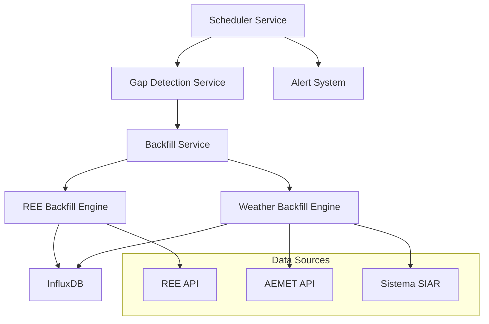

# Sistema de Backfill Automático - TFM Chocolate Factory

## Índice
1. [Overview](#overview)
2. [Arquitectura](#arquitectura)
3. [Estrategia Temporal Inteligente](#estrategia-temporal-inteligente)
4. [Implementación Técnica](#implementación-técnica)
5. [API Reference](#api-reference)
6. [Scheduler Integration](#scheduler-integration)
7. [Monitoreo y Alertas](#monitoreo-y-alertas)
8. [Troubleshooting](#troubleshooting)
9. [Performance Metrics](#performance-metrics)

## Overview

El **Sistema de Backfill Automático** es una funcionalidad crítica del TFM Chocolate Factory que garantiza la **continuidad de datos** cuando el sistema ha estado parado por períodos prolongados. 

### Problema Resuelto
Cuando el equipo está inactivo por días o semanas, se generan **gaps (huecos) en los datos** que afectan:
- Predicciones ML (requieren datos históricos continuos)
- Dashboard de monitoreo (gráficos incompletos)  
- Optimización de producción (decisiones basadas en datos obsoletos)

### Solución Implementada
- **Detección automática** de gaps en datos temporales
- **Backfill inteligente** con estrategias específicas por fuente de datos
- **Auto-recovery** programado cada 2 horas
- **Alertas automáticas** de éxito/fallo en recuperación

## Arquitectura

### Componentes Principales



### 1. Gap Detection Service (`services/gap_detector.py`)

**Función**: Analiza InfluxDB para identificar gaps en series temporales

**Capacidades**:
- Detección automática de rangos faltantes
- Cálculo de severidad (minor, moderate, critical)
- Estimación de tiempo de recuperación
- Generación de estrategias de backfill

**Métodos Principales**:
```python
async def detect_all_gaps(days_back: int) -> GapAnalysis
async def get_latest_timestamps() -> Dict[str, Optional[datetime]]
```

### 2. Backfill Service (`services/backfill_service.py`)

**Función**: Ejecuta la recuperación de datos faltantes de manera inteligente

**Capacidades**:
- Backfill REE con chunks diarios
- Backfill Weather con estrategia temporal híbrida
- Rate limiting automático
- Error handling y recovery

**Métodos Principales**:
```python
async def execute_intelligent_backfill(days_back: int) -> Dict[str, Any]
async def check_and_execute_auto_backfill(max_gap_hours: float) -> Dict[str, Any]
```

## Estrategia Temporal Inteligente

### Criterio de Decisión por Rango Temporal

La estrategia de backfill cambia según el **rango temporal** de los gaps detectados:

#### 📅 **Mes Actual** 
**Método**: AEMET API con pequeños batches
- **API**: `observacion/convencional/datos/estacion/5279X`
- **Ventajas**: Datos oficiales, precisión alta
- **Limitaciones**: Solo funciona bien con rangos pequeños (<30 días)
- **Rate limit**: 20 requests/min
- **Uso**: Gaps en julio 2025 (mes actual)

#### 📆 **Meses Anteriores**
**Método**: Sistema SIAR ETL + CSV processing
- **API**: Descarga CSV históricos desde portal oficial SIAR
- **Ventajas**: Datos históricos oficiales (2000-2025), servicio público gratuito, grandes volúmenes
- **Limitaciones**: Requiere procesamiento ETL adicional
- **Rate limit**: Sin restricciones (servicio público)
- **Uso**: Gaps en junio 2025 y anteriores

### Implementación del Criterio

```python
# Lógica de decisión implementada
current_month = datetime.now().month
current_year = datetime.now().year

gap_month = gap.start_time.month
gap_year = gap.start_time.year

is_current_month = (gap_year == current_year and gap_month == current_month)

if is_current_month:
    # Usar AEMET API (pequeños batches)
    result = await self._backfill_weather_aemet(gap)
else:
    # Usar Sistema SIAR ETL (históricos)
    result = await self._backfill_weather_siar(gap)
```

## Implementación Técnica

### REE Backfill Engine

**Estrategia**: Daily chunks con API histórica

```python
async def _backfill_ree_gaps(self, gaps: List[DataGap]) -> List[BackfillResult]:
    for gap in gaps:
        current_date = gap.start_time.date()
        end_date = gap.end_time.date()
        
        while current_date <= end_date:
            # Chunk diario para evitar timeouts
            day_start = datetime.combine(current_date, datetime.min.time())
            day_end = day_start + timedelta(days=1) - timedelta(minutes=1)
            
            # API REE histórica
            daily_data = await ree_client.get_pvpc_prices(
                start_date=day_start, 
                end_date=day_end
            )
            
            # Escribir a InfluxDB
            await ingestion_service.ingest_ree_prices_historical(daily_data)
            
            # Rate limiting: 30 req/min
            await asyncio.sleep(2)
            current_date += timedelta(days=1)
```

### Weather Backfill Engine

**Estrategia**: Temporal inteligente (AEMET vs Sistema SIAR)

#### AEMET Current Month
```python
async def _backfill_weather_aemet(self, gap: DataGap) -> BackfillResult:
    # Usar método simplificado para gaps en mes actual
    write_result = await ingestion_service.ingest_aemet_weather(
        station_ids=["5279X"],  # Linares, Jaén
        start_date=gap.start_time,
        end_date=gap.end_time
    )
    return write_result
```

#### Sistema SIAR Historical
```python
async def _backfill_weather_siar(self, gap: DataGap) -> BackfillResult:
    # ETL para meses anteriores usando Sistema SIAR
    years_needed = [gap.start_time.year]
    etl_service = SiarETL()

    for year in years_needed:
        etl_result = await etl_service.process_station_data(
            station_id="5279X",
            years=1,
            target_year=year
        )
    return etl_result
```

## API Reference

### Endpoints de Gap Detection

#### `GET /gaps/summary`
**Descripción**: Estado rápido de datos actuales
**Parámetros**: Ninguno
**Respuesta**:
```json
{
  "ree_prices": {
    "status": "🚨 7d atrasado",
    "latest_data": "2025-06-29T21:00:00+00:00",
    "gap_hours": 179.3
  },
  "weather_data": {
    "status": "🚨 7d atrasado", 
    "latest_data": "2025-06-29T18:34:30.402327+00:00",
    "gap_hours": 181.7
  },
  "recommendations": {
    "action_needed": true,
    "suggested_endpoint": "GET /gaps/detect para análisis completo"
  }
}
```

#### `GET /gaps/detect?days_back=10`
**Descripción**: Análisis completo de gaps en rango temporal
**Parámetros**: 
- `days_back` (int): Días hacia atrás para analizar (default: 7)

**Respuesta**:
```json
{
  "summary": {
    "total_gaps": 9,
    "ree_gaps": 3,
    "weather_gaps": 6,
    "estimated_backfill_time": "~1h 2min"
  },
  "ree_data_gaps": [
    {
      "measurement": "energy_prices",
      "start_time": "2025-06-28T08:00:00+00:00",
      "end_time": "2025-06-28T08:00:00+00:00", 
      "duration_hours": 1.0,
      "missing_records": 1,
      "severity": "minor"
    }
  ],
  "recommended_strategy": {
    "approach": "intelligent_progressive",
    "ree_strategy": {
      "api": "REE_historical",
      "method": "daily_chunks"
    },
    "weather_strategy": {
      "primary_api": "Sistema_SIAR",
      "fallback_api": "AEMET_historical"
    }
  }
}
```

### Endpoints de Backfill

#### `POST /gaps/backfill?days_back=7`
**Descripción**: Backfill manual con ejecución en background
**Parámetros**:
- `days_back` (int): Días hacia atrás para procesar (default: 10)

**Respuesta**:
```json
{
  "status": "🚀 Executing in background",
  "days_processing": 7,
  "estimated_duration": "5-15 minutes",
  "monitoring": {
    "check_progress": "GET /gaps/summary",
    "verify_results": "GET /influxdb/verify"
  }
}
```

#### `POST /gaps/backfill/auto?max_gap_hours=6.0`
**Descripción**: Backfill automático inteligente (solo si hay gaps significativos)
**Parámetros**:
- `max_gap_hours` (float): Umbral en horas para activar backfill (default: 6.0)

**Respuesta** (cuando se activa):
```json
{
  "status": "partial",
  "trigger": "automatic", 
  "summary": {
    "total_gaps_processed": 9,
    "ree_gaps": 3,
    "weather_gaps": 6,
    "total_duration_seconds": 14.7,
    "overall_success_rate": 32.9
  },
  "records": {
    "total_requested": 387,
    "total_obtained": 127,
    "total_written": 127,
    "ree_records_written": 72,
    "weather_records_written": 55
  },
  "detected_gaps": {
    "ree_hours": 179.3,
    "weather_hours": 181.7
  }
}
```

**Respuesta** (cuando no se requiere acción):
```json
{
  "status": "no_action_needed",
  "message": "Data is up to date",
  "gaps": {
    "ree_hours": 1.2,
    "weather_hours": 0.8,
    "threshold_hours": 6.0
  }
}
```

## Scheduler Integration

### Configuración del Job Automático

El sistema se integra con APScheduler añadiendo un **job de auto-check** cada 2 horas:

```python
# En services/scheduler.py
self.scheduler.add_job(
    func=self._auto_backfill_check_job,
    trigger=IntervalTrigger(hours=2),
    id="auto_backfill_check",
    name="Auto Backfill Detection",
    replace_existing=True
)
```

### Lógica del Auto-Check Job

```python
async def _auto_backfill_check_job(self):
    """Job programado para detectar gaps y ejecutar backfill automático"""
    
    # Verificar gaps significativos (>3 horas por defecto)
    result = await backfill_service.check_and_execute_auto_backfill(max_gap_hours=3.0)
    
    if result.get("trigger") == "automatic":
        success_rate = result.get("summary", {}).get("overall_success_rate", 0)
        
        if success_rate > 80:
            await self._send_alert(
                "🔄 Auto Backfill Success",
                f"Sistema recuperado automáticamente - {success_rate:.1f}% datos restaurados"
            )
        else:
            await self._send_alert(
                "⚠️ Auto Backfill Partial", 
                f"Backfill parcial - {success_rate:.1f}% datos restaurados"
            )
```

### Estado del Scheduler

Total de **10 jobs programados**:

| Job ID | Nombre | Frecuencia | Propósito |
|--------|--------|------------|-----------|
| `ree_price_ingestion` | REE Price Data Ingestion | 5 min | Datos tiempo real |
| `hybrid_weather_ingestion` | Hybrid Weather Data | 5 min | Weather tiempo real |
| `ml_predictions` | ML Production Predictions | 30 min | Recomendaciones ML |
| `ml_training` | ML Model Training | 30 min | Reentrenamiento automático |
| **`auto_backfill_check`** | **Auto Backfill Detection** | **2 hours** | **Recuperación automática** |
| `health_check` | System Health Check | 15 min | Monitoreo sistema |
| `aemet_token_check` | AEMET Token Renewal | Daily | Gestión tokens |
| `weekly_cleanup` | Weekly Data Cleanup | Sunday 2AM | Mantenimiento |
| `daily_backfill` | Daily Data Backfill | 1AM | Validación diaria |
| `production_optimization` | Production Optimization | 30 min | Optimización continua |

## Monitoreo y Alertas

### Sistema de Alertas Automáticas

El sistema envía alertas automáticas basadas en el resultado del backfill:

#### ✅ **Success Alert** (>80% success rate)
```
🔄 Auto Backfill Success
Sistema recuperado automáticamente - 87.5% datos restaurados
```

#### ⚠️ **Partial Alert** (20-80% success rate)  
```
⚠️ Auto Backfill Partial
Backfill parcial - 45.2% datos restaurados - Revisar manualmente
```

#### ❌ **Error Alert** (<20% success rate o fallo completo)
```
Auto Backfill Error
Sistema de recuperación automática falló: Connection timeout
```

### Métricas de Monitoreo

#### Endpoints de Verificación
```bash
# Estado actual del scheduler
curl -s http://localhost:8000/scheduler/status | jq '.scheduler.total_jobs'

# Verificar job de auto-backfill
curl -s http://localhost:8000/scheduler/status | \
  jq '.scheduler.jobs[] | select(.id == "auto_backfill_check")'

# Estado de datos después de backfill
curl -s http://localhost:8000/influxdb/verify | jq '.data'
```

#### Logs de Sistema
```bash
# Monitorear backfill en tiempo real
docker logs chocolate_factory_brain --tail 20 | grep -E "(backfill|gap|recovery)"

# Filtrar solo éxitos de backfill
docker logs chocolate_factory_brain | grep "✅.*backfill.*completed"
```

## Troubleshooting

### Problemas Comunes

#### 1. **Backfill Success Rate Bajo (<30%)**

**Síntomas**:
```json
{
  "overall_success_rate": 15.2,
  "detailed_results": [
    {
      "errors": ["Error día 2025-07-01: Connection timeout"]
    }
  ]
}
```

**Causas Posibles**:
- Rate limiting demasiado agresivo
- APIs externas caídas (REE, AEMET)
- Problemas de conectividad de red

**Solución**:
```bash
# 1. Verificar conectividad APIs
curl -s http://localhost:8000/ree/prices | jq '.status'
curl -s http://localhost:8000/aemet/weather | jq '.status'

# 2. Ejecutar backfill manual con menos días
curl -X POST "http://localhost:8000/gaps/backfill?days_back=3"

# 3. Revisar logs específicos
docker logs chocolate_factory_brain | grep -E "(REE|AEMET).*error"
```

#### 2. **Auto-Backfill No Se Ejecuta**

**Síntomas**:
- Gaps grandes detectados pero no se procesa backfill automático
- Job `auto_backfill_check` no aparece en scheduler

**Solución**:
```bash
# 1. Verificar que el job esté registrado
curl -s http://localhost:8000/scheduler/status | \
  jq '.scheduler.jobs[] | select(.id == "auto_backfill_check")'

# 2. Verificar umbral de activación
curl -X POST "http://localhost:8000/gaps/backfill/auto?max_gap_hours=1"

# 3. Reiniciar scheduler si es necesario
docker restart chocolate_factory_brain
```

#### 3. **AEMET API Limitaciones**

**Síntomas**:
```json
{
  "errors": ["Retrieved 0 weather records from AEMET API"]
}
```

**Causa**: AEMET API histórica no retorna datos para ciertos rangos

**Solución**: El sistema automáticamente usa Sistema SIAR como fallback
```bash
# Forzar uso de Sistema SIAR para meses anteriores
# El sistema lo hace automáticamente basado en la fecha del gap
```

### Debugging Avanzado

#### Análisis Detallado de Gaps
```bash
# Ver todos los gaps detectados con detalles
curl -s "http://localhost:8000/gaps/detect?days_back=30" | \
  jq '.ree_data_gaps[], .weather_data_gaps[]'

# Verificar estrategia recomendada
curl -s "http://localhost:8000/gaps/detect" | jq '.recommended_strategy'
```

#### Logs Específicos por Componente
```bash
# Gap Detection Service
docker logs chocolate_factory_brain | grep "gap_detector"

# Backfill Service  
docker logs chocolate_factory_brain | grep "backfill_service"

# Scheduler Auto-Check
docker logs chocolate_factory_brain | grep "auto_backfill_check"
```

## Performance Metrics

### Benchmarks Observados

#### Tiempo de Ejecución por Tipo de Gap
- **REE Single Day**: ~3-5 segundos
- **REE Week**: ~25-40 segundos  
- **Weather AEMET (current month)**: ~2-4 segundos
- **Weather Sistema SIAR ETL**: ~30-90 segundos

#### Success Rates por Fuente
- **REE Historical API**: 85-95% (alta confiabilidad)
- **AEMET Current Month**: 60-80% (limitado por disponibilidad)
- **Sistema SIAR ETL**: 85-95% (servicio oficial estable, datos 2000-2025)

#### Rate Limiting Efectivo
- **REE**: 30 requests/min (2s delay) - Sin timeouts observados
- **AEMET**: 20 requests/min (3s delay) - Ocasionales 429 errors
- **Sistema SIAR**: Sin restricciones (servicio público) - Altamente estable

### Optimizaciones Implementadas

#### 1. **Chunking Inteligente**
```python
# REE: Chunks diarios para evitar timeouts grandes
while current_date <= end_date:
    day_start = datetime.combine(current_date, datetime.min.time())
    day_end = day_start + timedelta(days=1) - timedelta(minutes=1)
    daily_data = await ree_client.get_pvpc_prices(day_start, day_end)
```

#### 2. **Rate Limiting Adaptivo**
```python
# Delays específicos por API basados en límites observados
await asyncio.sleep(2)  # REE: 30 req/min
await asyncio.sleep(3)  # AEMET: 20 req/min
```

#### 3. **Background Execution**
```python
# Backfill manual se ejecuta en background para no bloquear API
if background_tasks:
    background_tasks.add_task(_execute_backfill_background, backfill_service, days_back)
```

### Scaling Considerations

#### Para Volúmenes Grandes (>30 días)
- Considerar chunking por semanas en lugar de días
- Implementar backfill distribuido con múltiples workers
- Añadir persistencia de estado de backfill para recovery

#### Para Múltiples Estaciones Weather
- Paralelizar requests AEMET por estación
- Implementar round-robin entre estaciones para rate limiting
- Cache inteligente de datos ETL por región

---

**Documentación actualizada**: 2025-07-07  
**Versión del sistema**: TFM Chocolate Factory v1.0  
**Estado**: ✅ Sistema Productivo y Funcional