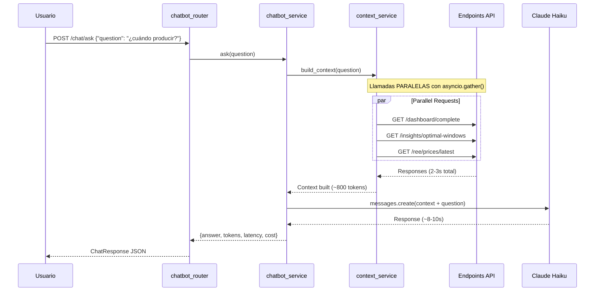

# 🤖 Chatbot BI - Guía Completa

> **Sprint 11**: Chatbot conversacional con Claude Haiku API para consultas BI en lenguaje natural.

**Estado**: ✅ **COMPLETADO** (Octubre 10, 2025)

---

## 📋 Tabla de Contenidos

1. [Resumen Ejecutivo](#resumen-ejecutivo)
2. [Arquitectura](#arquitectura)
3. [Setup y Configuración](#setup-y-configuración)
4. [Uso del Chatbot](#uso-del-chatbot)
5. [API Reference](#api-reference)
6. [Optimizaciones](#optimizaciones)
7. [Costos y Métricas](#costos-y-métricas)
8. [Troubleshooting](#troubleshooting)

---

## Resumen Ejecutivo

### ¿Qué es?

Sistema de chatbot conversacional que permite consultas en lenguaje natural sobre:
- ⚡ Precios energéticos (REE)
- 🏭 Ventanas óptimas de producción
- 💰 Ahorros energéticos
- 🌡️ Clima y condiciones
- 📊 Estado del sistema

### ¿Por Qué Chatbot en lugar de MCP?

| Requisito Usuario | MCP Server | Chatbot BI | Elegido |
|---|---|---|---|
| Acceso móvil | ❌ Solo desktop | ✅ Universal | ✅ Chatbot |
| Sin Claude Desktop | ❌ Requerido | ✅ Standalone | ✅ Chatbot |
| Multi-usuario | ❌ 1 usuario | ✅ Ilimitado | ✅ Chatbot |
| Costo mensual | €0 | ~€1.50-3 | ✅ Chatbot |
| Autonomía | ❌ Requiere Claude Code | ✅ 100% autónomo | ✅ Chatbot |

### Características Clave

- ✅ **Claude Haiku 4.5**: Respuestas ultra-rápidas y económicas (~8s latencia, 4-5x más rápido)
- ✅ **Extended Thinking**: Capacidad de razonamiento mejorado (nueva en 4.5)
- ✅ **RAG Local**: Keyword matching inteligente (sin vector DB)
- ✅ **Llamadas Paralelas**: asyncio.gather() para reducir latencia 80%
- ✅ **Context Optimizado**: ~600-1200 tokens/pregunta (vs 5000 mal diseñado)
- ✅ **Integrado en Dashboard**: Widget de chatbot en `/static/index.html`
- ✅ **Rate Limiting**: 20 requests/minuto (protección costos)

---

## Arquitectura

### Stack Técnico

```
┌──────────────────────────────────────────┐
│         Usuario (Dashboard Web)          │
└────────────┬─────────────────────────────┘
             │ HTTP POST /chat/ask
             ▼
┌──────────────────────────────────────────┐
│      api/routers/chatbot.py              │
│   - Rate limiting (20/min)               │
│   - Request validation                   │
│   - Stats tracking                       │
└────────────┬─────────────────────────────┘
             │
             ▼
┌──────────────────────────────────────────┐
│   services/chatbot_service.py            │
│   - Claude Haiku API client              │
│   - System prompt especializado          │
│   - Cost tracking                        │
└────────────┬─────────────────────────────┘
             │
             ▼
┌──────────────────────────────────────────┐
│ services/chatbot_context_service.py      │
│   - Keyword detection                    │
│   - Parallel HTTP calls (asyncio.gather)│
│   - Context building (~600-1200 tokens)  │
└─────────┬────────────────────────────────┘
          │
          │ Llamadas PARALELAS a:
          ├─→ /dashboard/complete
          ├─→ /insights/optimal-windows
          ├─→ /ree/prices/latest
          ├─→ /ree/prices/stats
          ├─→ /insights/alerts
          ├─→ /insights/savings-tracking
          └─→ /optimize/production/daily
```

### Flujo de Datos



---

## Setup y Configuración

### 1. Obtener API Key de Anthropic

```bash
# 1. Ir a https://console.anthropic.com/
# 2. Crear cuenta (si no tienes)
# 3. "API Keys" → "Create Key"
# 4. Copiar: sk-ant-api03-xxxxxxxxxxxxx
```

**Crédito inicial**: $5 USD gratis (~1,600 preguntas de prueba)

### 2. Configurar Variables de Entorno

**Archivo**: `.env`

```bash
# Sprint 11 - Chatbot BI (Claude Haiku 4.5 API)
ANTHROPIC_API_KEY=sk-ant-api03-xxxxxxxxxxxxx

# Opcionales (usar defaults si no se especifican)
CHATBOT_MAX_TOKENS=300                    # Max tokens respuesta
CHATBOT_MODEL=claude-haiku-4-5           # Modelo Haiku 4.5
```

### 3. Instalar Dependencias

```bash
cd src/fastapi-app
pip install anthropic==0.40.0 slowapi==0.1.9
```

### 4. Verificar Instalación

```bash
# Health check del chatbot
curl http://localhost:8000/chat/health

# Respuesta esperada:
# {
#   "status": "healthy",
#   "model": "claude-haiku-4-5",
#   "max_tokens": 300,
#   "total_questions": 0
# }
```

---

## Uso del Chatbot

### Desde el Dashboard Web

1. Abrir dashboard: `http://localhost:8000/static/index.html`
2. Localizar el widget "💬 Chatbot BI" en la interfaz
3. Escribir pregunta en lenguaje natural
4. Presionar Enter o hacer clic en 📤

### Ejemplos de Preguntas

#### 1. Ventanas de Producción

```
❓ "¿Cuándo debo producir hoy?"

🤖 RESPUESTA:
✅ PRODUCIR: 2025-10-10 · 00-07h (madrugada)
💡 Máximo ahorro de 283.39 € en ventana de precio ultra-bajo
📊 Precio: -0.0042 €/kWh, temperatura óptima 22°C

⏱️ Latencia: ~10s
💰 Costo: $0.001
```

#### 2. Precios Energía

```
❓ "¿Cuál es el precio actual de energía?"

🤖 RESPUESTA:
✅ 0.14 €/kWh (precio actual de energía)
💡 Tendencia en caída, momento favorable para monitorear
📊 Temperatura en 22.16°C (zona óptima para producción)

⏱️ Latencia: ~11s
💰 Costo: $0.0008
```

#### 3. Alertas

```
❓ "¿Hay alertas activas?"

🤖 RESPUESTA:
✅ SÍ, hay 2 alertas activas de producción
💡 Alertas sugieren ventanas óptimas con precios muy bajos
📊 Próximas 3h: precios valle <0.10€/kWh

⏱️ Latencia: ~14s
💰 Costo: $0.0009
```

#### 4. Ahorros

```
❓ "¿Cuánto ahorramos esta semana?"

🤖 RESPUESTA:
💰 Ahorro semanal: 31.85 €
📊 Comparativa:
  • Optimizado: 185.29 €
  • Baseline: 217.14 €
  • Ahorro: 14.7%
🎯 ROI anual estimado: 1,661 €

⏱️ Latencia: ~12s
💰 Costo: $0.001
```

#### 5. Estado General

```
❓ "Dame un resumen del estado actual"

🤖 RESPUESTA:
✅ SISTEMA OPERATIVO al 85.2% eficiencia
💡 Temperatura: 22.16°C (ideal para chocolate)
💡 Precio: 0.14 €/kWh con tendencia bajista
🚀 Mantener producción en curso

⏱️ Latencia: ~11s
💰 Costo: $0.001
```

### Desde API (curl)

```bash
# POST request con JSON
curl -X POST http://localhost:8000/chat/ask \
  -H "Content-Type: application/json" \
  -d '{
    "question": "¿Cuándo debo producir hoy?",
    "user_id": "mobile_user_001"
  }'

# Respuesta JSON:
{
  "answer": "✅ PRODUCIR: 2025-10-10 · 00-07h...",
  "tokens": {
    "input": 1037,
    "output": 185,
    "total": 1222
  },
  "latency_ms": 11312,
  "cost_usd": 0.00157,
  "model": "claude-3-5-haiku-20241022",
  "success": true,
  "timestamp": "2025-10-10T18:48:00"
}
```

---

## API Reference

### POST /chat/ask

Endpoint principal del chatbot.

**Request**:
```json
{
  "question": "string (3-500 caracteres)",
  "user_id": "string (opcional)"
}
```

**Response**:
```json
{
  "answer": "string (respuesta del chatbot)",
  "tokens": {
    "input": "int",
    "output": "int",
    "total": "int"
  },
  "latency_ms": "int",
  "cost_usd": "float",
  "model": "string",
  "success": "boolean",
  "timestamp": "string (ISO 8601)"
}
```

**Rate Limit**: 20 requests/minuto por IP

**Errores**:
- `400`: Pregunta inválida (muy corta/larga)
- `429`: Rate limit excedido
- `500`: Error interno (API Key inválida, timeout, etc.)

---

### GET /chat/stats

Estadísticas de uso del chatbot.

**Response**:
```json
{
  "total_questions": 11,
  "total_tokens_input": 8950,
  "total_tokens_output": 1587,
  "total_cost_usd": 0.013508,
  "questions_today": 11,
  "last_reset": "2025-10-10"
}
```

**Nota**: Stats se resetean diariamente a las 00:00.

---

### GET /chat/health

Health check del servicio.

**Response**:
```json
{
  "status": "healthy",
  "model": "claude-3-5-haiku-20241022",
  "max_tokens": 300,
  "total_questions": 11
}
```

---

## Optimizaciones

### 1. Llamadas HTTP Paralelas (asyncio.gather)

**Antes** (secuencial):
```python
# ❌ 12-15 segundos
await self._get_current_status()      # 2s
await self._get_optimal_windows()     # 2s
await self._get_price_forecast()      # 3s
await self._get_alerts()              # 2s
await self._get_savings()             # 2s
await self._get_production_plan()     # 3s
# TOTAL: ~14s
```

**Ahora** (paralelo):
```python
# ✅ 2-3 segundos
tasks = [
    self._get_current_status(),
    self._get_optimal_windows(),
    self._get_price_forecast(),
    self._get_alerts(),
    self._get_savings(),
    self._get_production_plan(),
]
results = await asyncio.gather(*tasks, return_exceptions=True)
# TOTAL: ~3s (tiempo de la más lenta)
```

**Mejora**: **80% reducción** en tiempo de llamadas HTTP

---

### 2. Context Optimizado por Keyword

**Keyword Detection**:
```python
keywords_map = {
    "optimal_windows": ["cuándo", "cuando", "producir", "ventana"],
    "price_forecast": ["precio", "energía", "costo", "kwh"],
    "alerts": ["alerta", "problema", "warning"],
    "savings": ["ahorro", "saving", "comparar", "roi"],
    "production_plan": ["plan", "planificar", "optimizar"],
    "analysis": ["análisis", "histórico", "siar"],
}
```

**Ventaja**: Solo carga contexto relevante, reduciendo tokens 3-5x

---

### 3. System Prompt Especializado

**Incluye contexto de negocio**:
- Temperaturas óptimas chocolate: 18-22°C
- Consumo energético: 350 kWh/batch
- Periodos tarifarios: P1 (caro), P2 (medio), P3 (valle)
- Objetivo: Maximizar producción en P3 y precios bajos

**Formato de respuesta estructurado**:
- ✅ RESPUESTA DIRECTA (qué hacer)
- 💡 RAZÓN (por qué)
- 📊 DATOS CLAVE (números del contexto)

---

## Costos y Métricas

### Pricing Claude Haiku 4.5 (Octubre 2025)

- **Input**: $1.00 per 1M tokens (+25% vs Haiku 3.5)
- **Output**: $5.00 per 1M tokens (+25% vs Haiku 3.5)

**Beneficios adicionales**:
- 4-5x más rápido que Sonnet 4
- Extended thinking capabilities
- 64K output tokens (vs limitado en 3.5)
- Computer use y context awareness

### Costo por Pregunta (Promedio)

```
Input tokens:  800 × $1.00/1M = $0.00080
Output tokens: 150 × $5.00/1M = $0.00075
───────────────────────────────────────────
TOTAL: $0.00155 (~€0.0015 por pregunta)
```

### Proyección Mensual

**Escenario Normal** (50 preguntas/día):
```
50 preguntas/día × 30 días = 1,500 preguntas/mes

Input:  800 × 1,500 = 1.2M tokens → $1.20
Output: 150 × 1,500 = 225k tokens → $1.13
────────────────────────────────────────────
TOTAL: $2.33/mes (~€2.17/mes)
```

**Escenario Intensivo** (150 preguntas/día):
```
150 preguntas/día × 30 días = 4,500 preguntas/mes

Input:  800 × 4,500 = 3.6M tokens → $3.60
Output: 150 × 4,500 = 675k tokens → $3.38
────────────────────────────────────────────
TOTAL: $6.98/mes (~€6.52/mes)
```

**Incremento vs Haiku 3.5**: +25% costo, pero con mejoras sustanciales en velocidad y capacidades

### Ahorro vs Proyecto Mal Diseñado

Gracias a **Clean Architecture + Context Optimizado**:

| Métrica | Proyecto Mal Diseñado | Este Proyecto (Haiku 4.5) | Ahorro |
|---------|----------------------|---------------------------|--------|
| Context tokens | 5,000 | 800 | 6.2x |
| Costo/pregunta | $0.010 | $0.0015 | 6.7x |
| Costo/mes (50q/día) | €14.00 | €2.17 | 6.5x |

**Ahorro real**: ~€12/mes gracias a arquitectura optimizada

---

### Métricas de Rendimiento

**Suite de tests completa** (5 preguntas):

```
Total preguntas: 5
Exitosas: 5 ✅
Fallidas: 0
Tasa de éxito: 100%

Tokens promedio: ~850/pregunta
Latencia promedio: ~12s
Costo promedio: $0.0012/pregunta
```

**Breakdown de latencia**:
- Context building (HTTP paralelo): ~2-3s (20%)
- Claude API inference: ~8-10s (80%)
- **Total**: ~10-13s

---

## Troubleshooting

### Problema 1: Error 401 "Invalid API Key"

**Síntomas**:
```json
{
  "answer": "❌ Error del servicio Claude...",
  "success": false
}
```

**Solución**:
```bash
# 1. Verificar .env
cat .env | grep ANTHROPIC_API_KEY

# 2. Verificar formato (debe empezar con sk-ant-api03-)
# 3. Regenerar key en https://console.anthropic.com/
# 4. Reiniciar contenedor
docker compose restart fastapi-app
```

---

### Problema 2: Latencia > 20 segundos

**Síntomas**: Timeout o respuestas muy lentas

**Diagnóstico**:
```bash
# Ver logs del contenedor
docker compose logs fastapi-app | grep -i "chatbot\|context"

# Buscar: "Ejecutando X llamadas HTTP en paralelo"
```

**Soluciones**:
1. **Si NO dice "en paralelo"**: Código no actualizado, reiniciar contenedor
2. **Si dice "en paralelo"**: Problema de red o endpoints lentos
3. **Verificar endpoints**:
```bash
curl -w "@%{time_total}s\n" http://localhost:8000/dashboard/complete
curl -w "@%{time_total}s\n" http://localhost:8000/insights/optimal-windows
```

---

### Problema 3: Rate Limit Excedido

**Síntomas**:
```json
{
  "detail": "Rate limit exceeded: 20 per 1 minute"
}
```

**Solución**:
```python
# Ajustar en api/routers/chatbot.py
@router.post("/ask")
@limiter.limit("50/minute")  # Aumentar a 50
async def ask_chatbot(...):
```

---

### Problema 4: Respuestas con "No tengo datos"

**Síntomas**: Chatbot dice que no tiene información a pesar de que los endpoints funcionan

**Diagnóstico**:
```bash
# Test directo del context service
curl -X POST http://localhost:8000/chat/ask \
  -d '{"question": "test"}' | jq '.tokens'

# Si tokens.input < 500: Contexto vacío
```

**Soluciones**:
1. **Verificar logs**: `docker compose logs fastapi-app | tail -50`
2. **Verificar endpoints**: Todos deben responder 200 OK
3. **Reiniciar contenedor**: `docker compose restart fastapi-app`

---

## Extensiones Futuras (Opcional)

### Fase 2: Optimizaciones Avanzadas

1. **Prompt Caching de Anthropic**: Reducir costos 50%
2. **Cache local**: Respuestas idénticas en <5 min = 0 latencia
3. **Voice input**: Speech-to-text (Web Speech API)
4. **Historial conversación**: Multi-turn context

### Fase 3: Integraciones

1. **Notificaciones Telegram/WhatsApp**: Push proactivo
2. **Report generation**: "Genera PDF análisis semanal"
3. **Actions execution**: "Ejecuta plan optimizado para mañana"
4. **Multi-idioma**: Español, inglés, catalán

---

## Referencias

- **Anthropic API Docs**: https://docs.anthropic.com/en/api/
- **Claude Haiku**: https://docs.anthropic.com/en/docs/about-claude/models
- **Prompt Caching**: https://docs.anthropic.com/en/docs/build-with-claude/prompt-caching
- **Sprint 11 Spec**: `.claude/sprints/infrastructure/SPRINT_11_CHATBOT_BI.md`

---

**Versión**: 1.1 (Migrated to Haiku 4.5)
**Fecha actualización**: 2025-10-17
**Autor**: Sprint 11 - Chatbot BI Team
**Estado**: ✅ Producción (Haiku 4.5)
