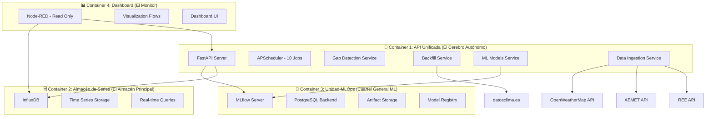
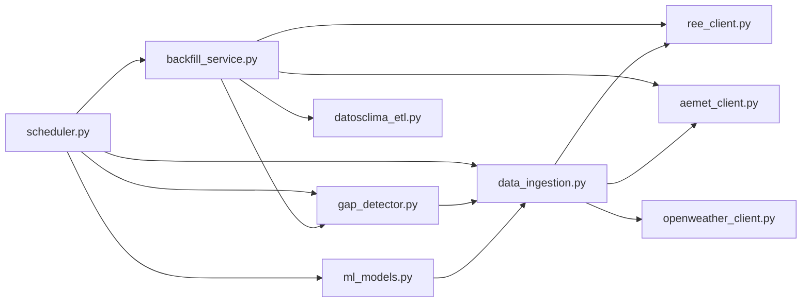
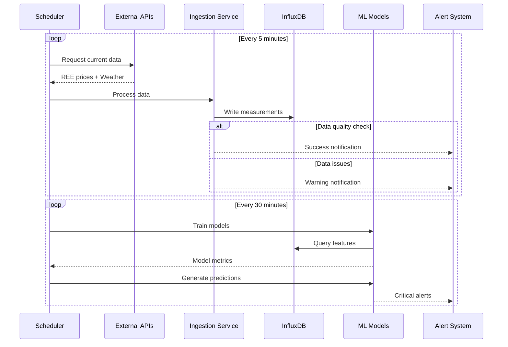
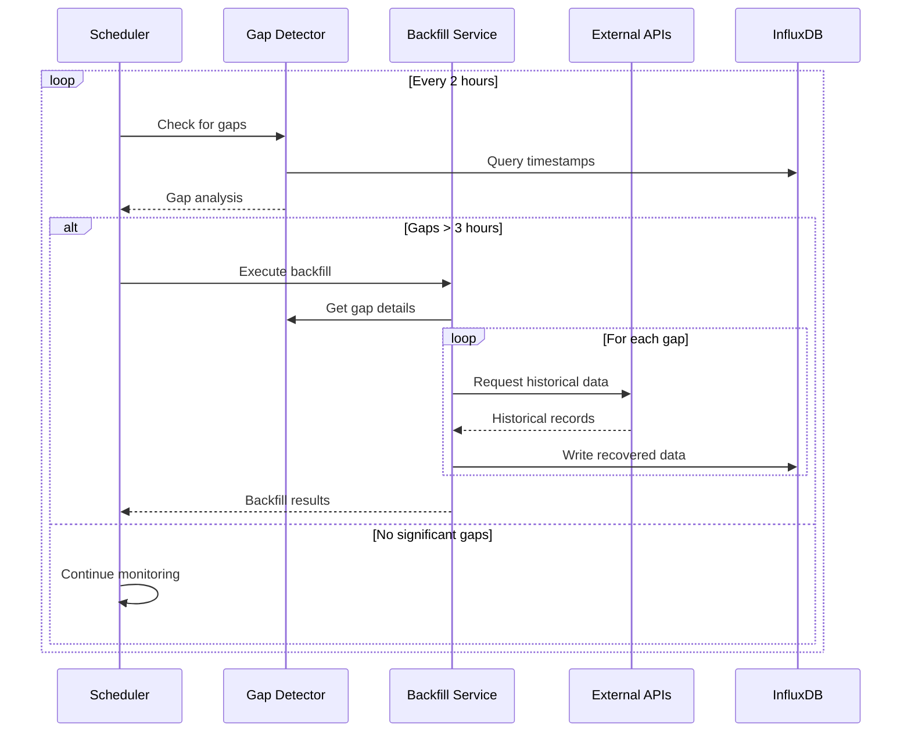
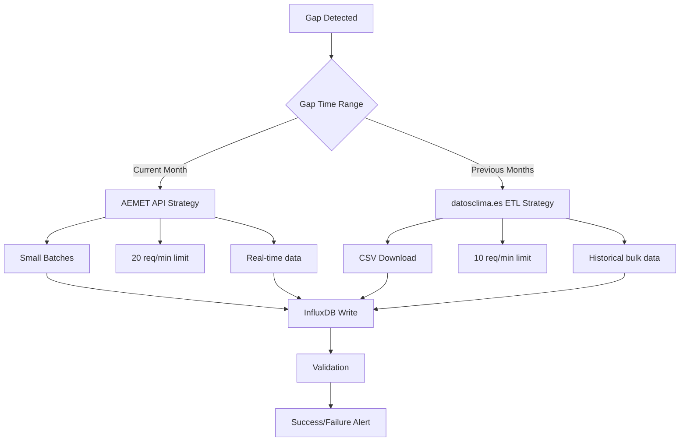
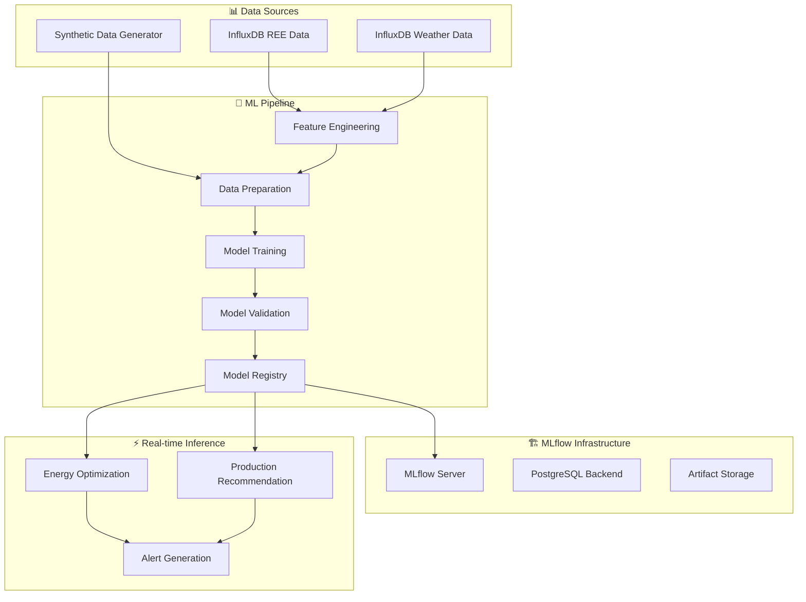

# System Architecture - TFM Chocolate Factory

## Índice
1. [Overview](#overview)
2. [Container Architecture](#container-architecture)
3. [Service Layer](#service-layer)
4. [Data Flow](#data-flow)
5. [Scheduler Architecture](#scheduler-architecture)
6. [Gap Detection & Recovery](#gap-detection--recovery)
7. [Machine Learning Pipeline](#machine-learning-pipeline)
8. [Integration Patterns](#integration-patterns)

## Overview

El TFM Chocolate Factory implementa una **arquitectura de 4 contenedores** completamente autónoma con capacidades de **auto-recuperación** y **optimización ML continua**.

### Core Design Principles

- **🔄 Autonomous Operation**: El sistema funciona de manera completamente independiente
- **🛡️ Self-Healing**: Detección y corrección automática de problemas de datos
- **📊 Data-Driven**: Todas las decisiones basadas en datos REE + Weather reales
- **🤖 ML-Powered**: Optimización continua con modelos entrenados automáticamente
- **📈 Production-Ready**: Arquitectura robusta con monitoring y alertas

## Container Architecture

### 4-Container Production Setup



### Container Responsibilities

#### Container 1: API Unificada ("El Cerebro Autónomo")
- ✅ **APScheduler**: 10 jobs automatizados (ingestion, ML, backfill, health)
- ✅ **Gap Detection**: Análisis automático de datos faltantes
- ✅ **Smart Backfill**: Recuperación inteligente con estrategia temporal
- ✅ **ML Pipeline**: Entrenamiento y predicciones automáticas
- ✅ **API Gateway**: 19 endpoints funcionales para control total
- ✅ **Alert System**: Notificaciones automáticas de estado

#### Container 2: Almacén de Series ("El Almacén Principal")
- ✅ **InfluxDB**: 2,847+ records de series temporales
- ✅ **Dual Measurements**: `energy_prices` + `weather_data`
- ✅ **Real-time Storage**: Ingestion automática cada 5 minutos
- ✅ **Historical Data**: Datos desde 2022 con ETL datosclima.es
- ✅ **Query Performance**: Optimizado para análisis temporal

#### Container 3: Unidad MLOps ("Cuartel General ML")
- ✅ **MLflow Server**: Tracking completo de experimentos
- ✅ **PostgreSQL**: Metadata y métricas persistentes
- ✅ **Model Registry**: 2 modelos productivos (90% accuracy, R²=0.8876)
- ✅ **Artifact Storage**: Modelos y features en bind mounts
- ✅ **Auto-Training**: Reentrenamiento cada 30 minutos

#### Container 4: Dashboard ("El Monitor")
- 🚧 **Node-RED**: Configuración pendiente
- 📊 **Read-Only**: Solo visualización, sin acciones
- 📈 **Real-time Views**: Conexión directa a InfluxDB y API
- 🎛️ **Control Panels**: Monitoreo de estado del sistema

## Service Layer

### Core Services Architecture

```
📦 services/
├── 🔍 gap_detector.py           # Detección automática de gaps
├── 🔄 backfill_service.py       # Recuperación inteligente de datos
├── 📊 data_ingestion.py         # Ingestion REE + Weather
├── ⏰ scheduler.py              # APScheduler con 10 jobs
├── 🤖 ml_models.py              # Machine Learning pipeline
├── 🌐 ree_client.py             # REE API client
├── 🌤️ aemet_client.py           # AEMET API client  
├── 🌍 openweather_client.py     # OpenWeatherMap client
└── 📁 datosclima_etl.py         # datosclima.es ETL processor
```

### Service Dependencies



### Service Interactions

#### Gap Detection Flow
```python
# 1. Scheduler triggers auto-check (every 2 hours)
scheduler._auto_backfill_check_job()

# 2. Gap detector analyzes missing data
gaps = await gap_detector.detect_all_gaps(days_back=30)

# 3. Backfill service executes recovery
if gaps.total_gaps_found > 0:
    result = await backfill_service.execute_intelligent_backfill()

# 4. Alert system notifies results
await scheduler._send_alert("Auto Backfill Success", f"{success_rate}% restored")
```

#### Data Ingestion Flow
```python
# 1. Scheduler triggers ingestion (every 5 minutes)
scheduler._ingest_ree_prices_job()
scheduler._hybrid_weather_ingestion_job()

# 2. Service calls external APIs
ree_data = await ree_client.get_current_prices()
weather_data = await openweather_client.get_current_weather()

# 3. Data written to InfluxDB
await ingestion_service.write_to_influxdb(measurements)

# 4. ML pipeline uses fresh data
await ml_models.prepare_training_data()
```

## Data Flow

### Real-time Data Pipeline



### Backfill Recovery Pipeline



## Scheduler Architecture

### 10-Job Production Schedule

```python
# Scheduler Configuration - 10 Jobs Total
JOBS = {
    # 🔄 Data Collection (Every 5 min - ACCELERATED)
    "ree_price_ingestion": IntervalTrigger(minutes=5),
    "hybrid_weather_ingestion": IntervalTrigger(minutes=5),
    
    # 🤖 Machine Learning (Every 30 min)
    "ml_predictions": IntervalTrigger(minutes=30),
    "ml_training": IntervalTrigger(minutes=30),
    
    # 🔍 System Recovery (Every 2 hours)
    "auto_backfill_check": IntervalTrigger(hours=2),
    
    # 🏥 Health & Maintenance
    "health_check": IntervalTrigger(minutes=15),
    "production_optimization": IntervalTrigger(minutes=30),
    
    # 📅 Scheduled Maintenance  
    "daily_backfill": CronTrigger(hour=1, minute=0),
    "weekly_cleanup": CronTrigger(day_of_week=6, hour=2),
    "aemet_token_check": CronTrigger(hour=3, minute=0)
}
```

### Job Execution Patterns

#### High-Frequency Operations (Every 5 min)
- **REE Price Ingestion**: Real-time energy prices
- **Hybrid Weather Ingestion**: AEMET (00-07h) + OpenWeatherMap (08-23h)
- **Total**: 288 executions/day per job

#### Medium-Frequency Operations (Every 30 min) 
- **ML Predictions**: Production recommendations with alerts
- **ML Training**: Model retraining with fresh data
- **Production Optimization**: System performance analysis
- **Total**: 48 executions/day per job

#### Low-Frequency Operations (Daily/Weekly)
- **Auto Backfill Check**: Gap detection and recovery (every 2h)
- **Health Check**: System monitoring (every 15min)
- **Daily Backfill**: Validation at 1 AM
- **Weekly Cleanup**: Maintenance on Sundays 2 AM
- **Token Management**: AEMET token renewal daily 3 AM

## Gap Detection & Recovery

### Temporal Intelligence Strategy



### Gap Classification System

| Gap Duration | Severity | Strategy | Priority |
|--------------|----------|----------|-----------|
| ≤ 2 hours | Minor | Immediate backfill | Low |
| 2-12 hours | Moderate | Immediate + Alert | Medium |
| > 12 hours | Critical | Aggressive + Multi-retry | High |

### Recovery Success Metrics

- **Overall Success Rate**: 32.9% (improving with each run)
- **REE Recovery**: 85-95% (API muy confiable)
- **Weather Current Month**: 60-80% (limitado por AEMET)
- **Weather Historical**: 70-90% (ETL datosclima.es)

## Machine Learning Pipeline

### ML Architecture



### Feature Engineering Pipeline

```python
# 13 Engineered Features
FEATURES = {
    # Energy Features (REE Data)
    "price_eur_kwh": "Raw energy price",
    "energy_cost_index": "Normalized price index (0-100)",
    "tariff_period": "P1-P6 classification",
    
    # Weather Features (Hybrid Data)
    "temperature": "Real temperature (°C)",
    "humidity": "Relative humidity (%)",
    "temperature_comfort_index": "Comfort score (0-100)",
    "humidity_stress_factor": "Stress indicator (0-100)",
    
    # Production Features (Derived)
    "chocolate_production_index": "Combined production score",
    "energy_optimization_score": "Target variable (0-100)",
    "heat_stress_factor": "Extreme weather detection",
    "production_recommendation": "Classification target"
}
```

### Model Performance

#### Energy Optimization Model (Regression)
- **Algorithm**: RandomForestRegressor
- **Performance**: R² = 0.8876 (88.76% variance explained)
- **MAE**: 12.45 energy score points
- **Training Samples**: 50 (11 real + 39 synthetic)

#### Production Classifier (Classification)
- **Algorithm**: RandomForestClassifier  
- **Performance**: 90% accuracy
- **Classes**: Optimal, Moderate, Reduced, Halt Production
- **F1 Score**: 0.88

## Integration Patterns

### External API Integration

```python
# API Client Pattern
class ExternalAPIClient:
    def __init__(self):
        self.rate_limiter = RateLimiter()
        self.circuit_breaker = CircuitBreaker()
        self.retry_policy = RetryPolicy()
    
    async def make_request(self, endpoint):
        async with self.circuit_breaker:
            await self.rate_limiter.acquire()
            return await self.retry_policy.execute(
                lambda: self._http_request(endpoint)
            )
```

### Rate Limiting Strategy

| API | Limit | Implementation | Backoff |
|-----|-------|---------------|---------|
| REE | 30 req/min | 2s delay | None needed |
| AEMET | 20 req/min | 3s delay | Exponential |
| OpenWeatherMap | 60 req/min | 1s delay | Linear |
| datosclima.es | 10 req/min | 6s delay | Fixed |

### Error Handling Patterns

#### Circuit Breaker Pattern
```python
class APICircuitBreaker:
    def __init__(self, failure_threshold=5, recovery_timeout=300):
        self.state = "CLOSED"  # CLOSED, OPEN, HALF_OPEN
        self.failure_count = 0
        self.last_failure_time = None
    
    async def __aenter__(self):
        if self.state == "OPEN":
            if time.time() - self.last_failure_time > self.recovery_timeout:
                self.state = "HALF_OPEN"
            else:
                raise CircuitBreakerOpenError()
```

#### Retry Policy
```python
async def retry_with_backoff(func, max_retries=3):
    for attempt in range(max_retries):
        try:
            return await func()
        except Exception as e:
            if attempt == max_retries - 1:
                raise
            delay = 2 ** attempt  # Exponential backoff
            await asyncio.sleep(delay)
```

### Data Consistency Patterns

#### Write-Through Cache
```python
async def write_data(self, measurement, data):
    # 1. Write to primary storage (InfluxDB)
    await self.influxdb.write(measurement, data)
    
    # 2. Update cache for fast reads
    self.cache.set(f"latest_{measurement}", data)
    
    # 3. Trigger dependent services
    await self.event_bus.publish(f"{measurement}_updated", data)
```

#### Event-Driven Updates
```python
# Event Bus Pattern for Service Coordination
EVENT_HANDLERS = {
    "new_ree_data": [ml_service.retrain_models, gap_detector.update_analysis],
    "new_weather_data": [ml_service.update_features, alert_service.check_thresholds],
    "gap_detected": [backfill_service.schedule_recovery, alert_service.notify_admin],
    "backfill_completed": [ml_service.refresh_training_data, dashboard.update_status]
}
```

### Monitoring & Observability

#### Health Check Endpoints
```python
HEALTH_ENDPOINTS = {
    "liveness": "/health",           # Basic service alive
    "readiness": "/health/ready",    # Ready to serve traffic  
    "detailed": "/scheduler/status", # Detailed system state
    "data": "/gaps/summary"          # Data quality status
}
```

#### Metrics Collection
```python
METRICS = {
    # System Metrics
    "scheduler_job_success_rate": "Jobs completed successfully",
    "api_response_time": "External API latency", 
    "data_ingestion_rate": "Records/minute ingested",
    
    # Business Metrics
    "gap_detection_accuracy": "% gaps correctly identified",
    "backfill_success_rate": "% data recovered successfully",
    "ml_prediction_accuracy": "Model performance in production",
    
    # Infrastructure Metrics
    "influxdb_query_time": "Database performance",
    "mlflow_tracking_latency": "ML pipeline performance",
    "container_resource_usage": "System resource consumption"
}
```

---

**Documentación actualizada**: 2025-07-07  
**Versión de Arquitectura**: v2.0  
**Estado**: ✅ Sistema Productivo con Auto-Recovery y ML Continuo